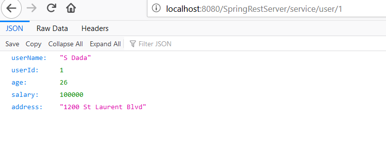
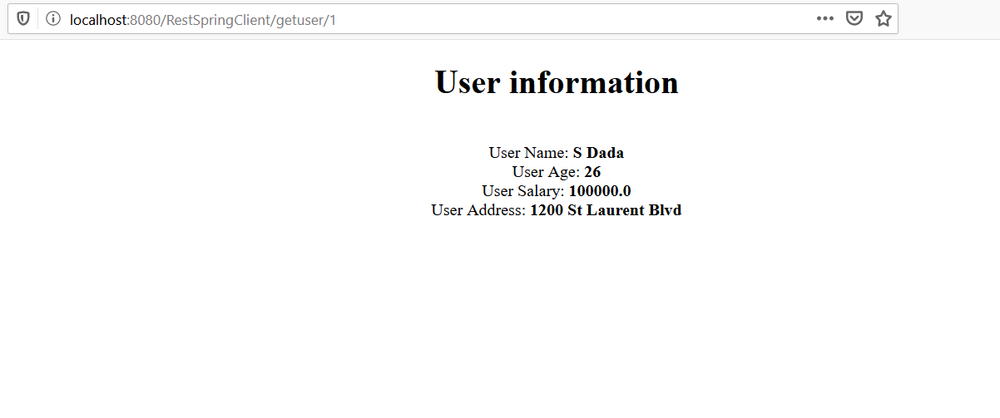
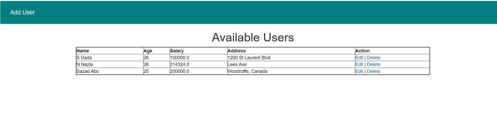
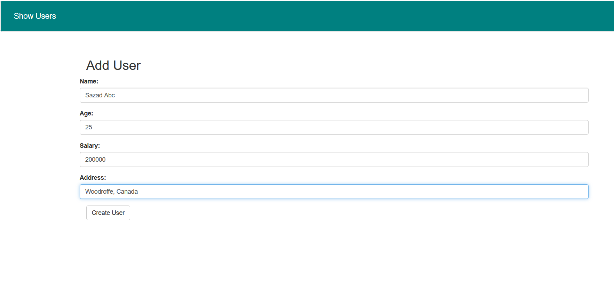
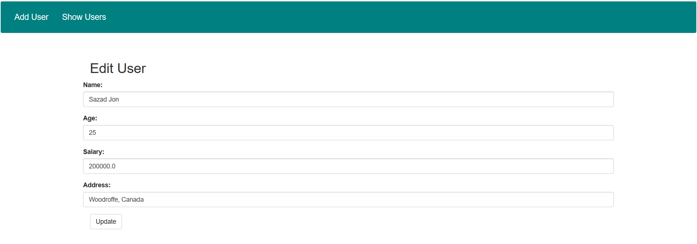

# rest-spring-db
To run the system and see the output we need to follow the following steps:

## Server (RestSpringServer):
-----------------------------
1. We have to create a database called "userrest" then run the queries from userrest.sql file at MySql/MariaDb server
2. Change following parameter according to your set-up at the database.properties file:
   db.username=root
   db.password=root
   db.url=jdbc:mysql://localhost:3306/userrest
2. Run the server app(RestSpringServer) as "Run on server" at eclipse (I am using Tomcat server)
3. You can hit the following url at browser :
http://localhost:8080/SpringRestServer/service/user/1   
-- (it only works if you are running at port 8080. If your server port is different than 8080, you have to try with that)

This will provide the user info with id 1.

## Client (RestSpringClient):
-----------------------------
To test with the client application, you must run the server app first like mentioned above because from the client app we are calling the available webservices from the server. Server is connected to the database server. So, as soon as we call a service URI, server app will try to connect to the database and response with data if find any.

1. Run the client app(RestSpringClient)  as "Run on server" at eclipse
2. Hit
 a. http://localhost:8080/RestSpringClient/getuser/1 to get a particular user(e.g. here 1 means user #1), internally calls rest service  http://localhost:8080/SpringRestServer/service/user/{id}

Response: 
Get particular user service result (Printed at the console): 
<200,userName=S Dada, userId=1, age=26, salary=100000.0, address=1200 St Laurent Blvd,[Content-Type:"application/json", Transfer-Encoding:"chunked", Date:"Mon, 20 Apr 2020 03:50:07 GMT", Keep-Alive:"timeout=20", Connection:"keep-alive"]>

### Client User Interface (UI):
For doing the CRUD operations, new UIs have been added (show all the users, add new user, edit user and delete a user).

1. Show all users: 
   URL: http://localhost:8080/RestSpringClient/getuserlist
This will call the webservie from the server app and URI to fetch all the users,
URI is: http://localhost:8080/SpringRestServer/service/user/

Client UI: 

2. Add a new user:  
   URL: http://localhost:8080/RestSpringClient/createuser
This will call the webservie from the server app and URI to add a new user,
URI is: http://localhost:8080/SpringRestServer/service/user/create . New user data has been included in the request body (POST Request).

Client UI: 

3. Edit a user: 
   URL: http://localhost:8080/RestSpringClient/updateuser/1 (Click the edit button from the "action" column of the user table, in this case   
   first user was clicked to edit)
This will call the webservie from the server app and URI to edit and update a user,
URI: http://localhost:8080/SpringRestServer/service/user/update/ . Update user data has been included in the request body (POST Request).
Server will internally perform a PUT request to update the user.

Client UI:

4. Delete a user: 
Click the delete button from the "action" column of the user table, it will delete that user.
This will call the webservie from the server app and URI to delete a user,
URI: http://localhost:8080/SpringRestServer/service/user/delete/{id}". Here id is the id of the user we are deleting.

## Further Improvement areas:
1. Add custom validation
2. Add logging (Log4j)
3. Organize code and make everything configurable 

